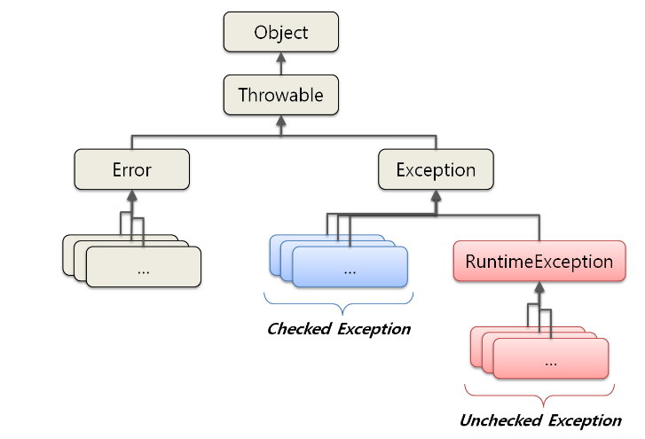

# Checked Exception과 Unchecked Exception

## Exception vs. Error
> **Error**
> 
> 시스템 레벨에서 발생하는 심각한 수준의 오류. 개발자가 미리 예측하여 처리할 수 없기때문에 예외 처리에 신경 쓰지 않아도 되는 부분이다.

> **Exception**
>
> logic 상에서 발생하는 오류로 개발자가 구현한 코드에서 발생하여 예외를 예측할 수 있고, 상황에 맞게 처리 가능하다.
<br></br>

## Exception Class 구조

이러한 예외 클래스들은 최상위 클래스인 Object를 상속받은 Throwable이라는 클래스를 기반으로 Error와 Exception 클래스로 나뉘며,
이때 Exception 클래스는 RuntimeException 상속 여부에 따라 ```Checked Exception```과 ```Unchecked Exception```으로 나뉜다.
<br></br>


- ```Checked Exception```은 ```Exception 클래스```를 상속 받아 정의되었다.
  - 반드시 오류를 처리해야하는 Exception
- ```Unchecked Exception```은 ```RuntimeException 클래스```를 상속받아 정의되었다.
    - 예외 처리하지 않아도 컴파일 시 오류 발생X
<br></br>
## Error(에러) 란?
시스템에 비정상적인 상황이 발생했을 경우 발생. 개발자가 예측하기도 처리하기도 어려움

> ex) ```OutofMemoryError```(메모리 부족)이나 ```StackOverflowError```(스택 오버플로우)와 같이 복구할 수 없는 것

## Exception(예외) 란?
프로그램 실행 중에 개발자의 실수로 예기치 않은 상황이 발생했을 때

> ex) ```ArrayIndexOutOfBoundsException```(배열의 범위를 벗어난), ```NullPointerException```(값이 null인 참조변수를 참조)
> , ```FileNotFoundException```(존재하지 않는 파일 이름)
> 
<br></br>
예외는 2가지로 나눌 수 있다.
> 1. **Checked Exception**
> 2. **UnChecked Exception**


### 1. Checked Exception
RuntimeException의 하위 클래스가 아니면서 ```Exception 클래스```의 하위 클래스들인 것
반드시 에러 처리(`try`-`catch` or `throw`)를 해야하는 특징을 가지고 있다.

ex) 
- ```FileNotFoundException```(존재하지 않는 파일 이름)
- ```ClassNotFoundException```(실수로 클래스 이름을 잘못 적음)

### 2. UnChecked Exception
RuntimeException(실행 중에 발생할 수 있는 예외)의 하위 클래스들을 의미.
컴파일러가 에러 처리를 확인하지 않음

checked Exception과 달리 에러 처리를 강제하지 않는다.

ex)
- ```ArrayIndexOutOfBoundsException```(배열의 범위를 벗어난)
- ```NullPointerException```(값이 null인 참조변수를 참조)


### 3. unChecked Exception이 예외처리를 강제하지 않는 이유
예시 

```java
public class ArrayExam {
    public static void main(String[] args) {
        try{
            int[] list = {1, 2, 3, 4, 5};
            System.out.println(list[0]);
        } catch(ArrayIndexOutOfBoundsException e){
            e.printStackTrace();
        }
    }
}
```

- 단순히 배열을 만들어 출력하는 구문인데 ```try-catch```문을 꼭 사용해야한다.
- 이러한 RuntimeExcetpion은 개발자들의 실수로 발생하는 것이므로 꼭 에러처리를 해주지 않아도 된다.
<br></br>

## Checked Exception과 UnChecked Exception의 Rollback 여부

|                    |                                        Checked  Exception                                        |                                                              UnChecked Exception                                                               |
|:-------------------|:------------------------------------------------------------------------------------------------:|:----------------------------------------------------------------------------------------------------------------------------------------------:|
| **처리여부**           |                                           반드시 예외 처리 필요                                           |                                                                 예외 처리를 강제하지 않음                                                                 |
| **확인 시점**          |                                              컴파일 단계                                              |                                                                 실행 단계(Runtime)                                                                 |
| **예외 발생시 트랜잭션 처리** |                                            Rollback X                                            |                                                                   Rollback O                                                                   |
| **대표 예외**        |  Exception의 상속을 받는 하위 클래스 중 Runtime Exception을 제외한 모든 예외<br/> - `IOException`<br/> - `SQLException`  |  RuntimeException의 상속을 받는 하위 클래스<br/> - `NullPointerException`<br/>-`IllegalArgumentException`<br/>-`IndexOutOfBoundException`<br/>-`SystemException`  |

<br></br>

#### 둘의 차이점 중 중요한 것은 **Rollback의 여부**이다.
- **Unchecked Exception** : Rollback이 되지 않고 트랜잭션이 Commit까지 완료
- **Checked Exception** : Rollback이 된다.

<br></br>
### 둘 중 선택하기
- 임의의 예외 클래스와 만들어 예외 처리를 하는 경우가 많은데, 이때 <U>```try-catch```문으로 묶어줄 필요가 있을 경우</U>에만 **Exception 클래스를 확장**한다.
- 일반적을 <U>실행 시 예외를 처리할 수 있는 경우</U>에는 RuntimeException 클래스를 확장해 **UnChecked Exception을 사용**하는 것이 좋다.


---
1. [Checked Exception과 Unchecked Exception](https://steady-coding.tistory.com/583)
2. [java Error, Checked Exception, Unchecked Exception](https://programmer93.tistory.com/71)
